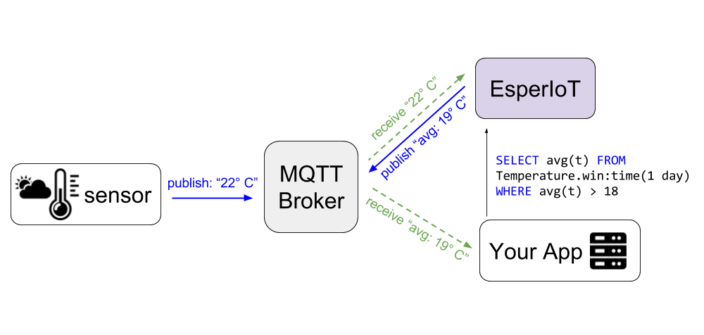

# EsperIoT

EsperIoT is an MQTT connector and configuration manager for Esper CEP Engine.
With EsperIoT, your application can specify any statements and subscribe upcoming results from the engine.



For example, a thermo sensor publishes measurements to a MQTT Broker.
EsperIoT allows you to create a new statement over REST Api such as 
selecting average value when it reaches a specific threshold for last 24 hours.
When measurement values reaches that condition, 
a new message will be published for regarding statement Mqtt topic.


## What is Esper?

Esper is a CEP which allows you to process data in memory by arrival. 
Esper has its own SQL like Domain Specific Language to process data, called 
[EPL](http://www.espertech.com/esper/release-6.0.1/esper-reference/html/epl_clauses.html)
In EPL:

* SQL → EPL
* Tables → Event Streams, Views
* Rows → Events

# How to run

You need a MQTT server running and
the easiest way to start one is Docker.

```
docker run --rm -it -p 1883:1883 eclipse-mosquitto
```

Now you can run EsperIoT:

```
./mvnw spring-boot:run -Drun.arguments=--mqtt.serverURI=tcp://127.0.0.1:1883
```

Go to the [Swagger UI](http://localhost:8080/swagger-ui.html) to explore the REST API.

## Features

* Spring Rest endpoints to
  * add/remove/list Esper statements
  * swagger-ui under `/swagger-ui.html`
* MQTT broker publish/subscribe service

## TODO

* Implementing some IoT object types as event to receive like:
  * [OGC SensorThings](http://docs.opengeospatial.org/is/15-078r6/15-078r6.html)
  * [Sensor Markup Language (SENML)](https://tools.ietf.org/html/draft-jennings-senml-10)
  * [SensorML](http://www.opengeospatial.org/standards/sensorml)
  * ...
* Adding new Examples and documentation
* New endpoints for changing engine configuration
* Integration Test
* use better mapper for DTO such as mapstruct
* Integration test

## License

EsperIoT is an extended work of Esper by EsperTech Inc., so it is released under [GNU Public License v2.0](LICENSE). 
Any new project based on this source code should also follow this license.
